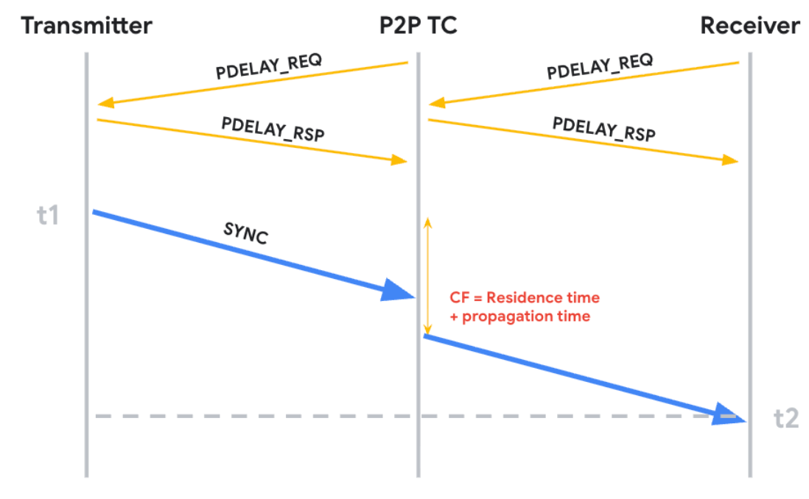

# Upstreaming PTP Peer-to-Peer (P2P) Path Delay Support in SAI
-------------------------------------------------------------------------------
 Title       | Upstreaming PTP Peer-to-Peer (P2P) Path Delay Support in SAI
-------------|-----------------------------------------------------------------
 Authors     | Gurprem Singh, Michael Cutforth, Eric Lance
 Status      | In review
 SAI-Version | 1.18
-------------------------------------------------------------------------------

# 1. Overview & Use Case

This proposal introduces support for the IEEE 1588 Peer-to-Peer (P2P) Path Delay
measurement mechanism in the Switch Abstraction Interface (SAI). The primary
goal of this feature is to remove the propagation time error for
synchronization. 

Rather than calculating end-to-end latency across the entire network, each port
independently measures the link propagation delay to its immediate neighbor. 



When a PTP event packet (such as a Sync or Follow_Up message) transits through a P2P
Transparent Clock (TC), the hardware must account for two distinct delays:

- Residence Time: The internal time the packet spent inside the switch
  (calculated as `egress_time - ingress_time`).
- Propagation Time: The previously measured link delay of the ingress port
  (`link_delay`).

By adding both the internal residence time and the ingress link propagation delay, 
the switch can accurately update the packet's Correction Field (CF) locally. This 
eliminates the impact of link propagation delay anomalies and allows downstream 
clocks to synchronize with incredibly high precision.

# 2. Proposed SAI Spec 

This proposal introduces spec to offload the high-frequency exchange of
IEEE 1588 Peer Delay messages to the underlying hardware. By defining a standard
profile, the underlying switch hardware can be configured to autonomously
transmit, receive, and timestamp Pdelay_Req and Pdelay_Resp packets across
multiple ports.

The control plane retains full visibility and flexibility through standard SAI
attributes. The steady state link propagation delay is programmed back into the
datapath via the `SAI_PORT_ATTR_LINK_DELAY` attribute which can be used to
update the Correction Field (CF) of transiting PTP event packets.

To cleanly separate the configuration of this hardware engine from the active
physical port state, we introduce a new configuration object type,
`SAI_OBJECT_TYPE_PTP_PDELAY`. This object acts as a reusable profile holding
the IEEE 1588 parameters for running the autonomous peer-delay engine (such as
MAC addresses, protocol, and intervals), which is then bound to physical ports.

## 2.1 Pdelay Profile Attributes (SAI_OBJECT_TYPE_PTP_PDELAY)

### SAI_PTP_PDELAY_ATTR_PORT_TYPE

- Value Type: sai_ptp_pdelay_type_t
- Flags: CREATE_AND_SET
- Description: Configure as Initiator, Responder, or Both.
    - SAI_PTP_PDELAY_TYPE_NONE
    - SAI_PTP_PDELAY_TYPE_INITIATOR
    - SAI_PTP_PDELAY_TYPE_RESPONDER
    - SAI_PTP_PDELAY_TYPE_BOTH

### SAI_PTP_PDELAY_ATTR_PTP_PROTOCOL

- Value Type: sai_ptp_protocol_t
- Flags: CREATE_AND_SET
- Description: Protocol transport (IEEE 802.3, UDP/IPv4, UDP/IPv6).
    - SAI_PTP_PROTOCOL_NONE
    - SAI_PTP_PROTOCOL_UDP_IPV4
    - SAI_PTP_PROTOCOL_UDP_IPV6
    - SAI_PTP_PROTOCOL_IEEE8023

### SAI_PTP_PDELAY_ATTR_SRC_MAC

- Value Type: sai_mac_t
- Flags: CREATE_AND_SET
- Description: Source MAC address used in egress Pdelay frames.

### SAI_PTP_PDELAY_ATTR_L2_HEADER_LEN

- Value Type: sai_uint8_t
- Flags: CREATE_AND_SET
- Description: Outer Layer-2 header encapsulation length in bytes.

### SAI_PTP_PDELAY_ATTR_PTP_L2_HEADER

- Value Type: sai_u8_list_t
- Flags: CREATE_AND_SET
- Description: Peer delay L2 header. The active number of header bytes in the list is specified by `SAI_PTP_PDELAY_ATTR_L2_HEADER_LEN`.

### SAI_PTP_PDELAY_ATTR_NETWORK_ADDR

- Value Type: sai_ip_address_t
- Flags: CREATE_AND_SET
- Description: Source IP address used for UDP transport encapsulation. Note: When configuring `SAI_PTP_PROTOCOL_UDP_IPV6`, an explicit IPv6 address must be specified since `@default` is `0.0.0.0`.

### SAI_PTP_PDELAY_ATTR_INGRESS_VLAN_ID

- Value Type: sai_uint16_t
- Flags: CREATE_AND_SET
- Description: Expected VLAN tag of incoming peer delay frames.

### SAI_PTP_PDELAY_ATTR_DOMAIN_NUMBER

- Value Type: sai_uint8_t
- Flags: CREATE_AND_SET
- Description: PTP Domain Number.

### SAI_PTP_PDELAY_ATTR_LOG_INTERVAL

- Value Type: sai_int32_t
- Flags: CREATE_AND_SET
- Description: Logarithmic interval of request packet transmission.

### SAI_PTP_PDELAY_ATTR_TTL

- Value Type: sai_uint8_t
- Flags: CREATE_AND_SET
- Description: Packet Time-To-Live.

### SAI_PTP_PDELAY_ATTR_IP_DSCP

- Value Type: sai_uint8_t
- Flags: CREATE_AND_SET
- Description: Packet IP DSCP priority mapping.

### SAI_PTP_PDELAY_ATTR_ENABLE

- Value Type: bool
- Flags: CREATE_AND_SET
- Description: Enable or disable the local Pdelay measurement engine.

## 2.2 Port-Level Attributes

### SAI_PORT_ATTR_PDELAY_INSTANCE_ID

- Value Type: sai_object_id_t
- Flags: CREATE_AND_SET
- Description: Associates the port with a specific configuration profile.
  Setting this to `SAI_NULL_OBJECT_ID` detaches the profile and disables P2P
  processing on the physical interface.

### SAI_PORT_ATTR_LINK_DELAY

- Value Type: sai_int64_t
- Flags: CREATE_AND_SET
- Description: Used by the control plane daemon to program the calculated
  steady-state link propagation delay (in nanoseconds) into the physical
  interface's hardware registers.

### SAI_PORT_ATTR_PDELAY_LINK_DELAY

- Value Type: sai_int64_t
- Flags: READ_ONLY
- Description: Instantaneous raw link delay (in nanoseconds), computed from the latest available set of T1/T2/T3/T4 timestamps.

### SAI_PORT_ATTR_PDELAY_NEIGHBOR_RATE_RATIO

- Value Type: sai_int32_t
- Flags: READ_ONLY
- Description: Computed neighbor frequency rate ratio in 2^30 scaled fixed-point format.

### SAI_PORT_ATTR_PDELAY_NEIGHBOR_PROPAGATION_DELAY

- Value Type: sai_uint32_t
- Flags: READ_ONLY
- Description: Filtered neighbor propagation delay (in nanoseconds) computed using Neighbor Rate Ratio (NRR).

### Relationship Between the Delay Attributes

Three delay values are exposed on the port object. They are related, but each
serves a distinct role.

`SAI_PORT_ATTR_PDELAY_LINK_DELAY` is the raw, instantaneous link delay derived
from the most recent peer delay timestamp exchange. It reflects a single
measurement. It is neither corrected for the frequency offset between the local
and neighbor clocks nor smoothed across successive exchanges, so it is expected
to vary from one measurement to the next. It is primarily useful for
diagnostics and for observing the behavior of the link over time.

`SAI_PORT_ATTR_PDELAY_NEIGHBOR_PROPAGATION_DELAY` is the steady-state
propagation delay. It is derived from the same timestamp exchanges, but the
interval measured by the neighbor is first normalized using the Neighbor Rate
Ratio to compensate for the frequency difference between the two clocks, and the
result is filtered across successive exchanges. This is the value intended for
steady-state use, computed as described in IEEE Std 802.1AS.

`SAI_PORT_ATTR_LINK_DELAY` is the delay value the NOS programs into the device
for datapath use which can be used to update the correction field of transiting
PTP event packets.

The first two attributes are read-only measurement outputs produced by the
hardware peer delay engine. The third is a control plane input. Keeping them
separate allows the NOS to apply its own filtering, hold-over behavior, or
static asymmetry correction before committing a value to the datapath, rather
than requiring the datapath to consume a raw measurement directly. It also
allows the delay to be supplied by the NOS on links where the hardware peer
delay engine is not in use.

## 2.3 Switch-Level Global Attributes

### SAI_SWITCH_ATTR_CLOCK_ID

- Value Type: sai_u8_list_t
- Flags: CREATE_AND_SET
- Description: Specifies the global clock identity of the PTP platform.
  An 8-octet array (`uint8_t[8]`) in network byte order as specified in IEEE
  Std 1588-2019.

### SAI_SWITCH_ATTR_PTP_PDELAY_MAX_PORTS

- Value Type: sai_uint16_t
- Flags: CREATE_AND_SET
- Description: Configures the maximum number of ports allocated for PTP
  peer-delay concurrently in firmware.

### SAI_SWITCH_ATTR_MAX_SUPPORTED_PTP_PDELAY_PORTS

- Value Type: sai_uint16_t
- Flags: READ_ONLY
- Description: Queries the platform's maximum hardware capacity limit of ports
  supporting peer delay exchanges.

### SAI_SWITCH_ATTR_PTP_PDELAY_IS_TWO_STEP

- Value Type: bool
- Flags: CREATE_AND_SET
- Description: Specifies whether the hardware PTP peer-delay engine operates in
  two-step mode (transmitting Pdelay_Resp_Follow_Up messages) or one-step mode
  for peer delay message exchanges.

## 2.4 PTP Pdelay Port Statistics

### SAI_PORT_STAT_PTP_PDELAY_TX_REQ_COUNT

- Description: Count of transmitted Peer Delay Request packets.

### SAI_PORT_STAT_PTP_PDELAY_RX_REQ_COUNT

- Description: Count of received Peer Delay Request packets.

### SAI_PORT_STAT_PTP_PDELAY_TX_RESP_COUNT

- Description: Count of transmitted Peer Delay Response packets.

### SAI_PORT_STAT_PTP_PDELAY_RX_RESP_COUNT

- Description: Count of received Peer Delay Response packets.

### SAI_PORT_STAT_PTP_PDELAY_TX_RESP_FOLLOWUP_COUNT

- Description: Count of transmitted Peer Delay Response Follow-Up packets.

### SAI_PORT_STAT_PTP_PDELAY_RX_RESP_FOLLOWUP_COUNT

- Description: Count of received Peer Delay Response Follow-Up packets.

### SAI_PORT_STAT_PTP_PDELAY_RESP_TIMEOUT_COUNT

- Description: Count of Peer Delay Response timeouts.

### SAI_PORT_STAT_PTP_PDELAY_RESP_FOLLOWUP_TIMEOUT_COUNT

- Description: Count of Peer Delay Response Follow-Up timeouts.

## 2.5 Coexistence with Existing PTP Model

The existing PTP model is not deprecated:

- **Hardware Offload Mode:** Active when `SAI_PORT_ATTR_PDELAY_INSTANCE_ID` is set to a valid profile. Peer delay packets are processed in hardware without trapping to the CPU, and the new delay attributes are active.
- **Existing Mode:** When `SAI_PORT_ATTR_PDELAY_INSTANCE_ID` is `SAI_NULL_OBJECT_ID`, `SAI_PORT_ATTR_PTP_PEER_MEAN_PATH_DELAY` can continue to be used.

### Model Applicability of New Attributes

- **Attributes Applicable to Both Models:**
  - `SAI_PORT_ATTR_LINK_DELAY`: Programs the datapath link delay in signed nanoseconds; can be used whether delay is calculated via hardware offload or by the NOS in software (e.g., if a signed value needs to be programmed instead of unsigned `SAI_PORT_ATTR_PTP_PEER_MEAN_PATH_DELAY`).
  - *(Note: All new switch-level attributes introduced in this proposal apply only to the hardware offload model).*

- **Attributes Inactive When Hardware Offload is Enabled (`SAI_PORT_ATTR_PDELAY_INSTANCE_ID != SAI_NULL_OBJECT_ID`):**
  - `SAI_PORT_ATTR_PTP_PEER_MEAN_PATH_DELAY`: Does not take effect on the port (datapath delay is driven by `SAI_PORT_ATTR_LINK_DELAY`).

- **Attributes Inactive When Existing Software Trap Mode is Active (`SAI_PORT_ATTR_PDELAY_INSTANCE_ID == SAI_NULL_OBJECT_ID`):**
  - Hardware offload measurement attributes (`SAI_PORT_ATTR_PDELAY_LINK_DELAY`, `SAI_PORT_ATTR_PDELAY_NEIGHBOR_RATE_RATIO`, `SAI_PORT_ATTR_PDELAY_NEIGHBOR_PROPAGATION_DELAY`) and statistics (`SAI_PORT_STAT_PTP_PDELAY_*`) do not take effect.
  - Switch-level offload attributes (`SAI_SWITCH_ATTR_CLOCK_ID`, `SAI_SWITCH_ATTR_PTP_PDELAY_MAX_PORTS`, `SAI_SWITCH_ATTR_MAX_SUPPORTED_PTP_PDELAY_PORTS`, `SAI_SWITCH_ATTR_PTP_PDELAY_IS_TWO_STEP`) have no effect on port packet processing.

## 3. API Workflow and Example

3.1 The global PTP clock identity must be initialized on the switch.

```c
sai_attribute_t attr;
attr.id = SAI_SWITCH_ATTR_CLOCK_ID;
attr.value.u8list.count = 8;
attr.value.u8list.list = my_clock_id;
sai_set_switch_attribute_fn(switch_id, &attr);
```

3.2 Creating a Pdelay Profile
An application creates a reusable Pdelay profile
configuration.

```c
sai_attribute_t attr_list[3];
attr_list[0].id = SAI_PTP_PDELAY_ATTR_PORT_TYPE;
attr_list[0].value.s32 = SAI_PTP_PDELAY_TYPE_BOTH;
attr_list[1].id = SAI_PTP_PDELAY_ATTR_LOG_INTERVAL;
attr_list[1].value.s32 = -3; // 8 packets per second
attr_list[2].id = SAI_PTP_PDELAY_ATTR_ENABLE;
attr_list[2].value.booldata = true;

sai_object_id_t pdelay_id;
sai_create_ptp_pdelay_fn(&pdelay_id, switch_id, 3, attr_list);
```

3.3 Binding Profile to a Port
The profile is bound to a physical interface to
activate hardware P2P processing.

```c
sai_attribute_t attr;
attr.id = SAI_PORT_ATTR_PDELAY_INSTANCE_ID;
attr.value.oid = pdelay_id;
sai_set_port_attribute_fn(port_id, &attr);
```
